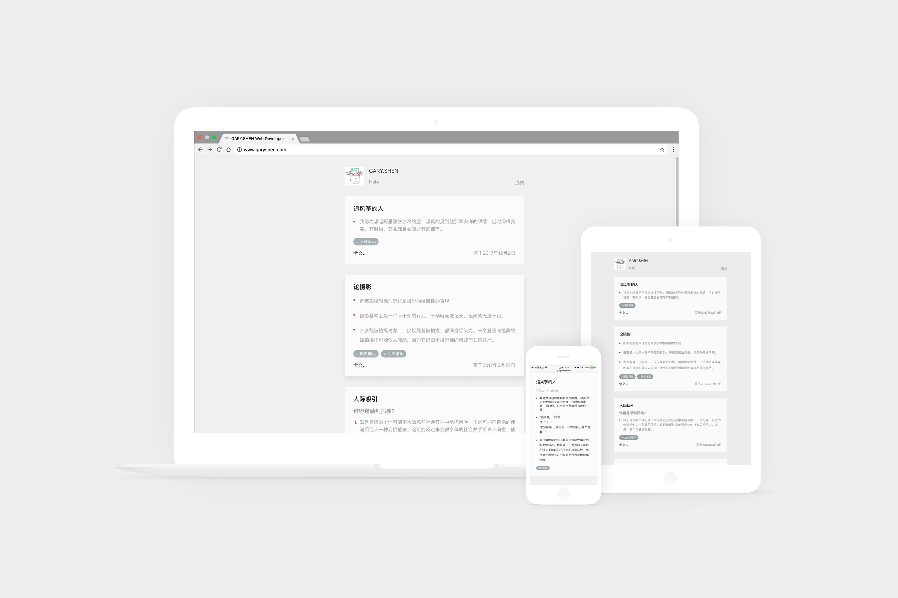
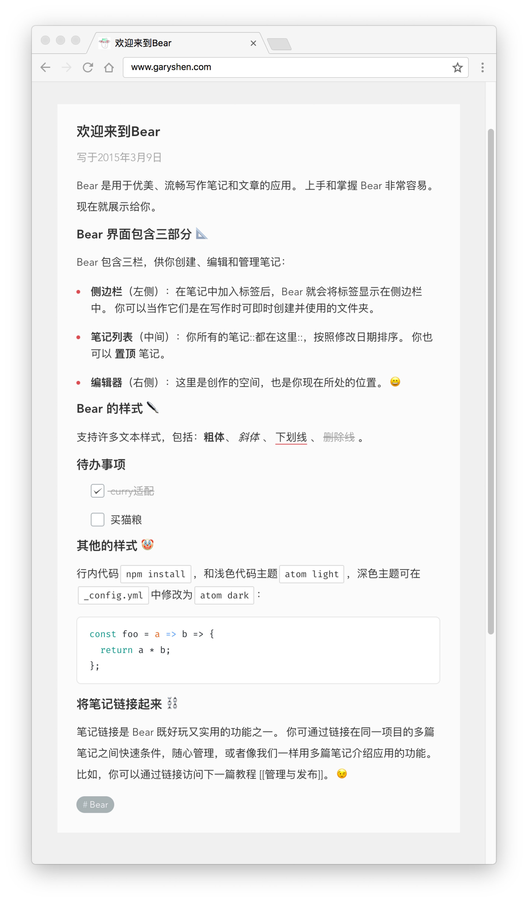

# hexo-theme-fetips


## Install

1. Download from GitHub
```shell
$ cd your-hexo-site
$ git clone https://github.com/gary-Shen/hexo-theme-fetips themes/fetips
```
2. Set the `theme` field in **your site** `_config.yml` to `fetips`
```yml
theme: fetips
```
3. ❤️ Install dependencies.  
Copy these [Dependencies in package.json](https://github.com/gary-Shen/hexo-theme-fetips/blob/master/package.json#L6) to **your site** `package.json` then run:
```
npm install
```

## Update

```shell
cd themes/fetips
git pull
```

## [Live Demo](http://www.garyshen.com)

## Screenshot



## Bear in fetips

# hexo-theme-fetips
